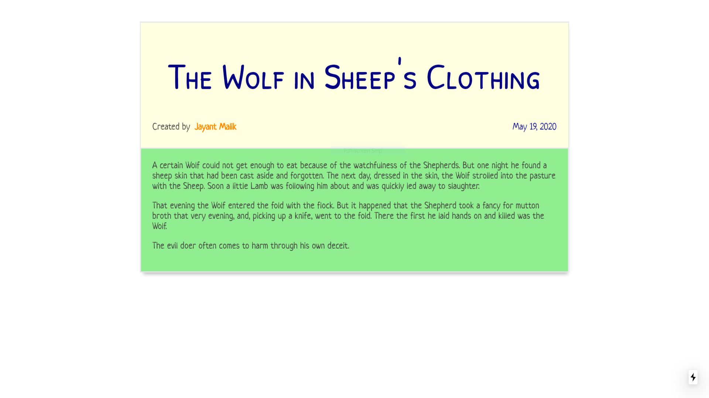

# Blogger Next.js

The application displays a list of blog posts and when user clicks the posts, the post opens.

The application prevents cross site script attacks by sanitizing the html, prior to rendering.

## Homepage

## Article Page

